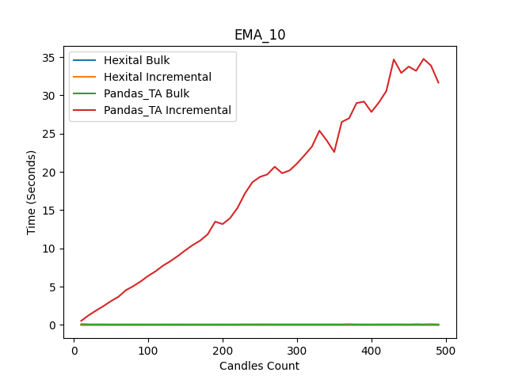
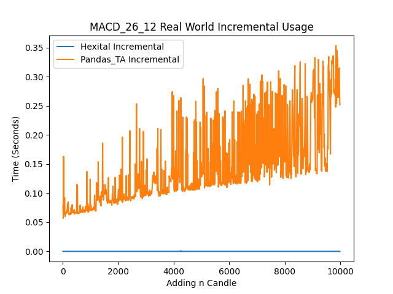
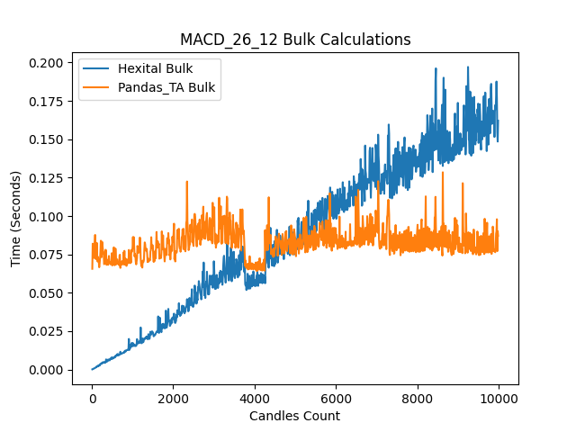

# Hexital - Incremental Technical Analysis Library
[]()
[](https://pypi.org/project/hexital/)
[](https://pypi.org/project/hexital/)

[](https://pepy.tech/project/hexital)
[](https://pepy.tech/project/hexital)

[](https://github.com/MerlinR/Hexital/actions/workflows/unit_test.yaml)
[](https://github.com/MerlinR/Hexital/actions/workflows/unit_test.yaml)
[]()

---

**Documentation**: [https://merlinr.github.io/Hexital/](https://merlinr.github.io/Hexital/)

**Source Code**: [https://github.com/MerlinR/Hexital](https://github.com/MerlinR/Hexital)

---

Hexital is a Modern, fast Python library designed for technical analysis in financial markets, offering a range of indicators commonly used in trading strategies. What sets Hexital apart is its innovative design around quick incremental calculations, users can enjoy swift and efficient computation of indicators, making it ideal for applications requiring real-time analysis or iterative data processing.

The key features are:

* **Fast**: High performance, faster then many other technical analysis libraries. *
* **Easy**: Designed for simplicity, with support for a variety of input data types.
* **Versatile**: Offers built-in tools for indicators, Candle patterns, Candlestick types and analysis tools.
* **Intuitive**: Consistent usage across indicators and tools, making it straightforward to use.
* **Lightweight**: Operates independently of third-party libraries for maximum simplicity.

<h6> * estimation based on tests on an internally with other TA libraries </h6>

The library differs from many other technical analysis libraries by employing an incremental computation method. Rather than reevaluating all data points, it selectively computes only the new or missing indicator values. This optimized approach ensures that generating new indicator values requires constant time complexity O(1), a stark contrast to the linear time complexity (O(n)) or worse exhibited by other libraries.

---

>   **__BETA NOTE:__**  Hexital is in Beta, all Major features are implemented and not expected to have drastic changes. However some changes will still cause some Non-backward compatible. Ensure to read Changelog


---

## Installation

### Stable

A Pip and pypi package of the latest stable version available on [Pypi](https://pypi.org/project/hexital/)

```bash
$ pip install hexital
```
### Latest

In case you want to install the latest development version from the repo.

```bash
$ pip install git+https://github.com/merlinr/hexital.git@development
```

---

## Getting Started - Examples

Below are simple use of generating EMA indicator and Hexital object from a set of Candles, more guides available [Here](guides/quick-start)

### EMA Indicator

An example of using Hexital to create an EMA indicator from a list of `dict` Candles.

```python linenums="1"
from hexital import EMA, Candle

my_candles = [
    {"open": 17213, "high": 2395, "low": 7813, "close": 3615, "volume": 19661},
    {"open": 1301, "high": 3007, "low": 11626, "close": 19048, "volume": 28909},
    {"open": 12615, "high": 923, "low": 7318, "close": 1351, "volume": 33765},
    {"open": 1643, "high": 16229, "low": 17721, "close": 212, "volume": 3281},
    {"open": 424, "high": 10614, "low": 17133, "close": 7308, "volume": 41793},
    {"open": 4323, "high": 5858, "low": 8785, "close": 8418, "volume": 34913},
    {"open": 13838, "high": 13533, "low": 4830, "close": 17765, "volume": 586},
    {"open": 14373, "high": 18026, "low": 7844, "close": 18798, "volume": 25993},
    {"open": 12382, "high": 19875, "low": 2853, "close": 1431, "volume": 10055},
    {"open": 19202, "high": 6584, "low": 6349, "close": 8299, "volume": 13199},
]
# Convert Basic candles
candles = Candle.from_dicts(my_candles)

my_ema = EMA(candles=candles, period=3)
my_ema.calculate()

print("Latest EMA reading:", my_ema.reading())  # 8408.7552
```

#### Appending new Candle
```python linenums="23"

# Append new Candle
my_ema.append(Candle.from_dict({'open': 19723, 'high': 4837, 'low': 11631, 'close': 6231, 'volume': 38993}))
print("EMA reading:", my_ema.reading())  # 7319.8776
```
> **__NOTE:__** The latest EMA value is automatically calculated on append.

####  Analysis EMA for rising trend
Hexital has several built in analysis functions to handle simple candle movements calculations.

```python linenums="28"
from hexital.analysis import rising

print("EMA Rising:" rising(my_ema, "EMA_3", length=8)) # False
```

---


### Hexital - Grouping

Hexital is designed for managing multiple indicators, having one set of candle's used by multiple indicator's they will automatically calculate new readings with new Candles.
An  example using `WMA` and `EMA` in one `hexital` object, and calculating both indicators.

```python linenums="1"
from hexital import EMA, WMA, Candle, Hexital

my_candles = [
    {"open": 17213, "high": 2395, "low": 7813, "close": 3615, "volume": 19661},
    {"open": 1301, "high": 3007, "low": 11626, "close": 19048, "volume": 28909},
    {"open": 12615, "high": 923, "low": 7318, "close": 1351, "volume": 33765},
    {"open": 1643, "high": 16229, "low": 17721, "close": 212, "volume": 3281},
    {"open": 424, "high": 10614, "low": 17133, "close": 7308, "volume": 41793},
    {"open": 4323, "high": 5858, "low": 8785, "close": 8418, "volume": 34913},
    {"open": 13838, "high": 13533, "low": 4830, "close": 17765, "volume": 586},
    {"open": 14373, "high": 18026, "low": 7844, "close": 18798, "volume": 25993},
    {"open": 12382, "high": 19875, "low": 2853, "close": 1431, "volume": 10055},
    {"open": 19202, "high": 6584, "low": 6349, "close": 8299, "volume": 13199},
]
candles = Candle.from_dicts(my_candles)

strategy = Hexital("Demo Strat", candles, [
    WMA(name="WMA", period=8),
    EMA(period=3),
])
strategy.calculate()

print("EMA reading:", strategy.reading("EMA_3")) # 8408.7552
print("WMA reading:", strategy.reading("WMA")) # 9316.4722

```

> **__NOTE:__** WMA is called WMA as we set, EMA is generated name from core name `EMA` and the `period`.

#### Appending new Candle
We can append a `Candle` to Hexital which is then used for all Indicator's, the EMA and WMA value's are again automatically calculated on append.

```python linenums="23"

# Append new Candle
strategy.append(
    Candle.from_dict({"open": 19723, "high": 4837, "low": 11631, "close": 6231, "volume": 38993})
)
# New readings from both indicators using new Candle
print("EMA reading:", strategy.reading("EMA_3"))  # 7319.8776
print("WMA reading:", strategy.reading("WMA"))  # 8934.9722
```

####  Analysis for EMA and WMA Crossing
The several built in analysis functions can handle check across multiple indicator.

```python linenums="30"
from hexital.analysis import cross

print("EMA Crossed WMA:" cross(my_ema, "EMA_3", "WMA")) # False
```

> **__NOTE:__** Can replace `cross` with `crossover` or `crossunder` for specific direction.

---

## Indicator's
A Further in depth list of [Indicators](indicator-catalogue.md).

- Average Directional Index (**ADX**)
- Aroon (**AROON**)
- Average True Range (**ATR**)
- Bollinger Bands (**BBANDS**)
- Counter (**Counter**)
- Chande Momentum Oscillator - (**CMO**)
- Donchian Channels (**Donchian**)
- Exponential Moving Average (**EMA**)
- Highest Lowest (**HL**)
- High Low Average (**HLA**)
- High Low Close (**HLC**)
- High Low Close Average (**HLCA**)
- Hull Moving Average (**HMA**)
- Jurik Moving Average Average (**JMA**)
- Keltner Channel (**KC**)
- Moving Average Convergence/Divergence (**MACD**)
- Money Flow Index (**MFI**)
- Midpoint Over Period (**MOP**)
- On Balance Volume (**OBV**)
- Pivot Points (**PivotPoints**)
- Relative Moving Average (**RMA**)
- Rate of Change (**ROC**)
- Relative strength Index (**RSI**)
- Relative Vigor Index (**RVI**)
- Simple Moving Average(**SMA**)
- Standard Deviation (**STDEV**)
- Standard Deviation Threshold (**STDEVT**)
- Stochastic Oscillator (**STOCH**)
- SuperTrend (**Supertrend**)
- True Range (**TR**)
- True Strength Index (**TSI**)
- Volume Weighted Average Price (**VWAP**)
- Volume Weighed Moving Averge (**VWMA**)
- Weighed Moving Average (**WMA**)

---

## Candlestick Patterns

Simple useful Candle pattern recognition, such as Doji, hammer, etc

- Doji
- Dojistar
- Hammer
- Inverted Hammer

---

## Candlestick Types

Hexital can also automatically convert Candlesticks into specific types, such as:

 - Heikin-Ashi

---

## Candlestick Movements

Simple useful Candle Analysis methods such as those in [Pine Scripting](https://www.tradingview.com/pine-script-reference/v5/)

- Positive/Negative Candle
- Rising/Falling
- Mean Based Rising/Falling Indicator
- Above/Below
- Highest/Lowest Indicator (Value)
- HighestBar/LowestBar Indicator (Offset how far back)
- Indicator Cross
- Indicator CrossOver/CrossUnder
- Flipped 

---

## Testing

Testing is a critical aspect of this library due to the complexity of ensuring the accuracy of generated indicator values. To achieve this, I rely on [Pandas-TA](https://github.com/twopirllc/pandas-ta) as the source of truth for indicator values. 
Each indicator added to this library has at least one unit test, where the output is compared against the corresponding indicator output from Pandas-TA. Due to slight differences in calculations, particularly within NumPy, not all values are exactly identical. Therefore, if differences exceed a given threshold (usually beyond one decimal place).

### Speed Tests

The following charts illustrate the speed of Pandas-TA and Hexital in both bulk and incremental calculations. These results are obtained from running Pandas-TA and Hexital in bulk  and incremental modes.




This chart illustrates the difference of performance for Hexital and Pandas-TA when calculating technical analysis. Demonstrating difference in calculation time for incrementally adding and regulating per candle; and bulk recalculating a specific number of candles. This chart demonstrates that traditional libraries like Pandas-TA, and others relying on Pandas, and NumPy suffer performance overhead during incremental processing due to memory reallocation when appending or concatenating data. This limitation is highlighted in their documentation, recommending processing data in bulk.

In contrast, Hexital's pure Python implementation delivers exceptional performance in both bulk and incremental processing, with minimal overhead. It not only outpaces Pandas-TA in incremental operations but also performs faster, particularly on smaller datasets.

#### Incremental Calculations
Using both libraries for a live incremental application, whereby at n candles we are appending a Candle to the dataset and calculating the new TA. It's clear Hexital is far out performing Pandas_TA, This is due to two major factors, firstly the speed of which python can append a list of data compared to Panda's dataframe; and secondly Hexital is only needs to calculate the latest candle compared to Pandas-TA which is recalculating the entire dataset.




<h6> For reference, if using seconds Candle with 10,000 candles that is around 2 Hours 46 minutes. </h6>

#### Bulk Calculations

In bulk calculations we see a different situation, Pandas-TA outperforms Hexital. Pandas-TA maintains consistent performance, with processing times starting at 0.08 seconds for 1,000 candles and remaining stable at this level for 10,000 candles. In contrast, Hexital exhibits faster processing times, starting at 0.025 seconds for 2,000 candles but increasing to 0.16 seconds for 10,000 candles. While Hexital is initially faster, there is a noticeable growth in processing time as the dataset size increases. Therefore, for backtesting with a large dataset, Pandas-TA offers superior performance, while Hexital may experience slowdowns.




---

## License

This project is licensed under the terms of the MIT license.