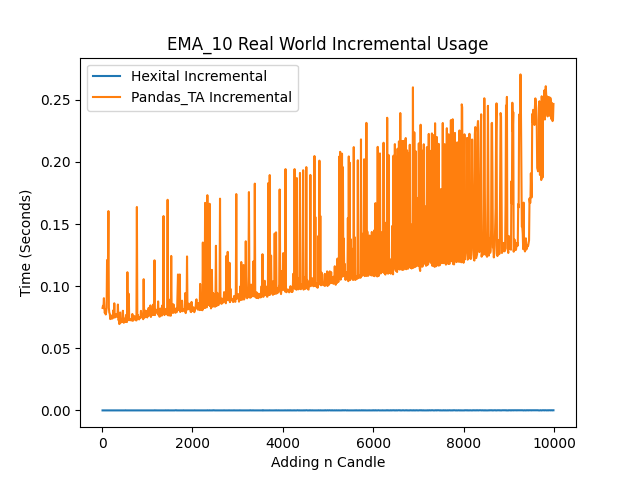

# Hexital - Incremental Technical Analysis Library
[](#license)
[](https://pypi.org/project/hexital/)
[](https://pypi.org/project/hexital/)
[](https://pypi.org/project/hexital/)
[](https://github.com/MerlinR/Hexital/actions/workflows/unit_test.yaml)
[](https://github.com/MerlinR/Hexital/actions/workflows/unit_test.yaml)

# `Beta`
Note: Hexital has entered Beta mode, being all Major features are implemented and not expected to have drastic changes. Future changes would include bug fixes, QOL additions and implementation of new Indicators, Candlestick patterns, movements and Candlestick types.

# Hexital
`Hexital` is a Python library implementing financial indicators for technical analysis. The distinctive feature of the library is its incremental computation of indicators which is designed to fit real-time applications or applications with iterative input in general.

For most libraries such as [Pandas-TA](https://github.com/twopirllc/pandas-ta) which is fantastic for generating Indicators for a large set of data, it's incredibly slow when computing real-time/incremental data sets. The entire input vector is always used to calculate new values of indicators, which is a major cause of this speed issue. Despite the fact that these indicator values will remain unchanged and/or you don't want past data points to be changed by new data. `Hexital` resolves this by using an incremental approach, only calculating new/missing indicator value's, this implies it requires O(1) time to produce new indicator values in comparison to O(n) (or worse) required by other libraries.


## Features

### Indicators
Hexital comes with a growing selection of available Indicators to compute. These can be used individually to calculate a single indicator, or used with the `Hexital` class to automatically compute multiple indicators with an incremental candle list; which is easily parsable.

### Candlestick Patterns
Hexital also supports detecting candle patterns, such as Doji, etc. This can be achieved easily by calling the Pattern function with the candles, or used automatically as an indicator where it would be computed alongside Indicators.

### Candlestick Types
Hexital also has the feature to automatically convert Candlesticks from the standard type into alternative formats, such as 'Heikin-Ashi'. This will mean prior to generating indicators it will automatically convert the Candlesticks to the desired type and then calculate indicators on this new candlestick type. This works in conjunction with all other features.

### Multi-Timeframes
Hexital has a key feature of supporting indicator and pattern computation on multiple candle timeframes with a single set of candles. For instance an indicator can be given second candlesticks and can calculate EMA on 1m candlesticks or 10m candlesticks, the indicator will automatically merge these candles into the required timeframes and compute the indicator value. * Cant go down, for obv reasons.

This can also be mixed within the `Hexital` class, allowing you to automatically compute a multiple incremental indictors and patterns of which consistent of multiple timeframes by appending a single candle of any timeframe. E.G By appending 1m candles  into `Hexital` you can automatically compute an RSI using the 5 minute candles and computing an EMA using the 10 minute candles, at the same time automatically while only adding 1m candlesticks.

Example:
```python
stratergy = Hexital("Test Stratergy", candlesticks_1m, [RSI(timeframe="T5"), EMA(timeframe=TimeFrame.MINUTE10)])
```

### Candlestick Movements
Hexital also comes built with some candle utility methods, to easily take the candles list and detect movements such as Rising Candles, indicator Cross overs, etc, these are designed to be simple to make using the candles and common features easy,  many of these are also found in pine scripting. 

## Indicators
- ADX
- ATR
- KC
- EMA
- HighLowAverage
- MACD
- OBV
- RMA
- RSI
- ROC
- SMA
- STOCH
- Supertrend
- TR
- VWAP
- VWMA
- WMA

## Candlestick Patterns
Simple useful Candle pattern recognition, such as Doji, hammer, etc
- Doji
- Hammer

## Candlestick Types
Hexital can also automatically convert Candlesticks into specific types, such as:
- Heikin-Ashi

## Candlestick Movements
Simple useful Candle Anaylsis methods such as those in [Pine Scripting](https://www.tradingview.com/pine-script-reference/v5/)
- Positive/Negative Candle
- Rising/Falling Indicator
- Mean Based Rising/Falling Indicator
- Highest/Lowest Indicator (Value)
- HighestBar/LowestBar Indicator (Offset how far back)
- Indicator Cross
- Indicator CrossOver/CrossUnder

## Installation
### Stable
Pip and pypi package version is the latest stable version.
```bash
pip install hexital
```
## Latest
In case you want to install the latest development version from the repo.
```bash
pip install git+https://github.com/merlinr/hexital.git@development
```

## Usage

### Single Indicator
```python
from hexital import EMA, Candle
import pandas as pd

my_candles = [
    {"open": 17213, "high": 2395, "low": 7813, "close": 3615, "volume": 19661},
    {"open": 1301, "high": 3007, "low": 11626, "close": 19048, "volume": 28909},
    {"open": 12615, "high": 923, "low": 7318, "close": 1351, "volume": 33765},
    {"open": 1643, "high": 16229, "low": 17721, "close": 212, "volume": 3281},
    {"open": 424, "high": 10614, "low": 17133, "close": 7308, "volume": 41793},
    {"open": 4323, "high": 5858, "low": 8785, "close": 8418, "volume": 34913},
    {"open": 13838, "high": 13533, "low": 4830, "close": 17765, "volume": 586},
    {"open": 14373, "high": 18026, "low": 7844, "close": 18798, "volume": 25993},
    {"open": 12382, "high": 19875, "low": 2853, "close": 1431, "volume": 10055},
    {"open": 19202, "high": 6584, "low": 6349, "close": 8299, "volume": 13199},
]
# Convert Basic candles
candles = Candle.from_dicts(my_candles)
# Or directly from a Numpy Dataframe
# df = pd.read_csv("path/to/symbol.csv", sep=",")
# candles = Candle.from_dicts(df.to_dict("records"))

my_ema = EMA(candles=candles, period=3)
my_ema.calculate()

# Indicator name is generated based on Indicator and parameters
print(my_ema.name) # EMA_3

# Check if started generating Readings
print(my_ema.has_reading) # True

# Get EMA indicator readings
# Latest
print(my_ema.reading()) # 8408.7552
# All
print(my_ema.as_list()) # [None, None, 8004.6667, 4108.3333, 5708.1667, 7063.0833, 12414.0416, 15606.0208, 8518.5104, 8408.7552]

# Add new
my_ema.append(Candle.from_dict({'open': 19723, 'high': 4837, 'low': 11631, 'close': 6231, 'volume': 38993}))
print(my_ema.as_list()) # [None, None, 8004.6667, 4108.3333, 5708.1667, 7063.0833, 12414.0416, 15606.0208, 8518.5104, 8408.7552, 7319.8776]

# Check Reading and Prev Reading
print(my_ema.reading()) # 7319.8776
print(my_ema.prev_reading()) # 8408.7552

# How many EMA readings been generated
print(my_ema.reading_count()) # 9

# Purge Readings
my_ema.purge()
print(my_ema.reading()) # None

# Purge and Re-calculate
my_ema.recalculate()
print(my_ema.reading()) # 7319.8776

# Recalculate latest
my_ema.calculate_index("EMA_3")

# Access other Readings (Reading get's the latest readings)
print(my_ema.reading("high")) # 4837

# Access other specific Readings (Older readings)
print(my_ema.reading("high", index=-2)) # 6584

# Easily view candlestick trends
print(my_ema.falling()) # True
```


## Upcoming Features

Roughly ordered in priority

- Modular framework (like indicators) to repaint candles, E.G as Renko, Range, etc 
- More Indicators
- More Movement methods
- More Patterns
- Indicator Pluggability, to allow easy extension of this library
  - Allowing custom Indictors to be added
- Multiprocessing, of indictors stored within hexial Class.
  - Likely wont see increase in performance


## Testing
Testing is a huge part of this library as it's incredibly difficult to ensure the accuracy of the indicator values being generated. In order to solve this this I rely on [Pandas-TA](https://github.com/twopirllc/pandas-ta) as my source of truth for the indicator values. Each indicator added to this library requires a test that uses the Pandas-TA lib indicator output as the expected result. Due to some difference's in the calculations done withinin Numpy, not all values are exactly identical, therefore if there are differences outside of the given 1 decimal place, than a pearson correlation coefficient is calculated to ensure correct correlation with the givne output.

### Speed Tests
The following charts indicate the results and speed of Pandas-TA and Hexital both Bulk and Incremental calculations these are the following results of running Pandas-TA and hexital both in Bulk (_all candles calculated at once_) and incremental (_Caluclating after each new candle is added_); charts _1 and 2_.

The incremental chart's here are calculating the TA, adding one, re-calculating up to N amount. Pandas-TA/Pandas/Numpy for incremental data is clearly a slow process, this from my understanding due to the underlying way numpy will append/concat data, having to re-create the memory rather than resize. This is why Numpy/Panda's recommend gathering all the data prior to running calculations on it. Whereby the bulk calculating in Pandas-TA is consistent with a small time increase with the amount of data. While `Hexital` running purely pythonic can run in quickly in bulk and incremental, with little to no extra overhead time; clearly performing far faster than Pandas-TA Incremental and even faster than Pandas-TA with smaller set of data. 


From chart _(3)_  you can clearly see that with bulk calculations with an extremely large dataset, Pandas-Ta performs better than `Hexital` in large Bulk data. Bulk calculations Pandas-TA going from 0.08 for 1,000 and staying there for 10,000, While Hexital Goes from 0.005 seconds for 1,000 to 0.05 seconds for 10,000. While Hexital is faster, there is a clear growth in process time. Therefore for backtesting with a large dataset, Pandas-TA will give you the best performance, whereas Hexital will continue to slow down.


However referencing chart _(4)_ being an example of using both these libraries for a live application, whereby at n candles we incrementing a dataset with a candle and calculating the new TA; `Hexital` is far quicker. This is due to the speed that python can increment a list of data rather than Panda, as well as `Hexital` only needing to calculate the newest candle rather than having to re-calculate the entire dataset. Chart _3_ clearly shows the speed benefits it has over Pandas-TA and other Panda based Technical Analysis tools for incremental data sets.



For reference, if using seconds Candle with 10,000 candles that is around 2 Hours 46 minutes.
#### Note
The code that produces these charts is: `tests/speed_tests/run_speed_test.py` and can be ran by calling `make speed-test`. Some noise is seen due to running on personal laptop while in use.
## Inspiration
This library was was inspired by [TALIpp](https://github.com/nardew/talipp) which is another Incremental Technical Analysis Library, however I disliked the seperate input lists rather then an entire candle, and futhermore outputs are seperated entities requiring lots of managing. Whereas Hexital stores all data within the Candles making easier usage.
