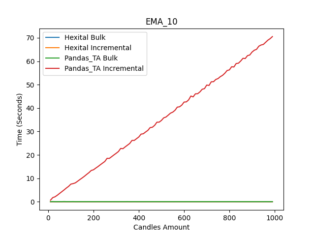

# Hexital - Incremental Technical Analysis Library
[](#license)
[](https://pypi.org/project/hexital/)
[](https://pypi.org/project/hexital/)
[](https://pypi.org/project/hexital/)
[](https://github.com/MerlinR/Hexital/actions/workflows/unit_test.yaml)
[](https://github.com/MerlinR/Hexital/actions/workflows/unit_test.yaml)

# `Alpha Development`❗
Note: Extremely early stages and likely change drastically, including core functionality and methods. Specifically until a basis for Patterns and Multi time TA are designed.
# Hexital
`Hexital` is a Python library implementing financial indicators for technical analysis. The distinctive feature of the library is its incremental computation of indicators which is designed to fit real-time applications or applications with iterative input in general.

For most libraries such as [Pandas-TA](https://github.com/twopirllc/pandas-ta) which is fantastic for generating Indicators for a large set of data, it's incredibly slow when computing real-time/incremental data sets. The entire input vector is always used to calculate new values of indicators, which is a major cause of this speed issue. Despite the fact that these indicator values will remain unchanged and/or you don't want past data points to be changed by new data. `Hexital` resolves this by using an incremental approach, only calculating new/missing indicator value's, this implies it requires O(1) time to produce new indicator values in comparison to O(n) (or worse) required by other libraries.


## Indicators
- ADX
- ATR
- KC
- EMA
- HighLowAverage
- MACD
- OBV
- RMA
- RSI
- ROC
- SMA
- STOCH
- Supertrend
- TR
- VWAP
- VWMA
- WMA


## Analysis
Simple useful Candle Anaylsis methods such as those in [Pine Scripting](https://www.tradingview.com/pine-script-reference/v5/)
- Positive/Negative Candle
- Rising/Falling Indicator
- Mean Based Rising/Falling Indicator
- Highest/Lowest Indicator (Value)
- HighestBar/LowestBar Indicator (Offset how far back)
- Indicator Cross
- Indicator CrossOver/CrossUnder


## Indicators
Simple useful Candle pattern recognition, such as Doji, hammer, etc
- Doji

## Installation
### Stable
Pip and pypi package version is the latest stable version.
```bash
pip install hexital
```
## Latest
In case you want to install the latest development version from the repo.
```bash
pip install git+https://github.com/merlinr/hexital.git@development
```


## Upcoming Features

Roughly ordered in priority

- More Indicators
- More Analysis methods
- Pattern Candle recognition methods, detecting Doji, Hammer, etc
- Pattern Indicators, use above methods to run automatically as indicators
- Support for automatic multi timeframe indicator generation
  - E.G: With 1 minute candles, we can generate EMA for minute candles and 5 minute candles
- Indicator Pluggability, to allow easy extension of this library
  - Allowing custom Indictors to be added
- Multiprocessing, of indictors stored within hexial Class.
  - Likely wont see increase in performance


## Testing
Testing is a huge part of this library as it's incredibly difficult to ensure the accuracy of the indicator values being generated. In order to solve this this I rely on [Pandas-TA](https://github.com/twopirllc/pandas-ta) as my source of truth for the indicator values. Each indicator added to this library requires a test that uses the Pandas-TA lib indicator output as the expected result. Due to some difference's in the calculations done withinin Numpy, not all values are exactly identical, therefore if there are differences outside of the given 1 decimal place, than a pearson correlation coefficient is calculated to ensure correct correlation with the givne output.

### Speed Tests
The following charts indicate the results and speed of Pandas-TA and Hexital both Bulk and Incremental calculations these are the following results of running Pandas-TA and hexital both in Bulk (_all candles calculated at once_) and incremental (_Caluclating after each new candle is added_); charts _1 and 2_.

The incremental chart's here are calculating the TA, adding one, re-calculating up to N amount. Pandas-TA/Pandas/Numpy for incremental data is clearly a slow process, this from my understanding due to the underlying way numpy will append/concat data, having to re-create the memory rather than resize. This is why Numpy/Panda's recommend gathering all the data prior to running calculations on it. Whereby the bulk calculating in Pandas-TA is consistent with a small time increase with the amount of data. While `Hexital` running purely pythonic can run in quickly in bulk and incremental, with little to no extra overhead time; clearly performing far faster than Pandas-TA Incremental and even faster than Pandas-TA with smaller set of data. 




From chart _(3)_  you can clearly see that with bulk calculations with an extremely large dataset, Pandas-Ta performs better than `Hexital` in large Bulk data. Bulk calculations Pandas-TA going from 0.08 for 1,000 and staying there for 10,000, While Hexital Goes from 0.005 seconds for 1,000 to 0.05 seconds for 10,000. While Hexital is faster, there is a clear growth in process time. Therefore for backtesting with a large dataset, Pandas-TA will give you the best performance, whereas Hexital will continue to slow down.

However referencing chart _(4)_ being an example of using both these libraries for a live application, whereby at n candles we incrementing a dataset with a candle and calculating the new TA; `Hexital` is far quicker. This is due to the speed that python can increment a list of data rather than Panda, as well as `Hexital` only needing to calculate the newest candle rather than having to re-calculate the entire dataset. Chart _3_ clearly shows the speed benefits it has over Pandas-TA and other Panda based Technical Analysis tools for incremental data sets.


For reference, if using seconds OHLCV with 10,000 candles that is around 2 Hours 46 minutes.
#### Note
The code that produces these charts is: `tests/speed_tests/run_speed_test.py` and can be ran by calling `make speed-test`. Some noise is seen due to running on personal laptop while in use.
## Inspiration
This library was was inspired by [TALIpp](https://github.com/nardew/talipp) which is another Incremental Technical Analysis Library, however I disliked the seperate input lists rather then an entire candle, and futhermore outputs are seperated entities requiring lots of managing. Whereas Hexital stores all data within the Candles making easier usage.
